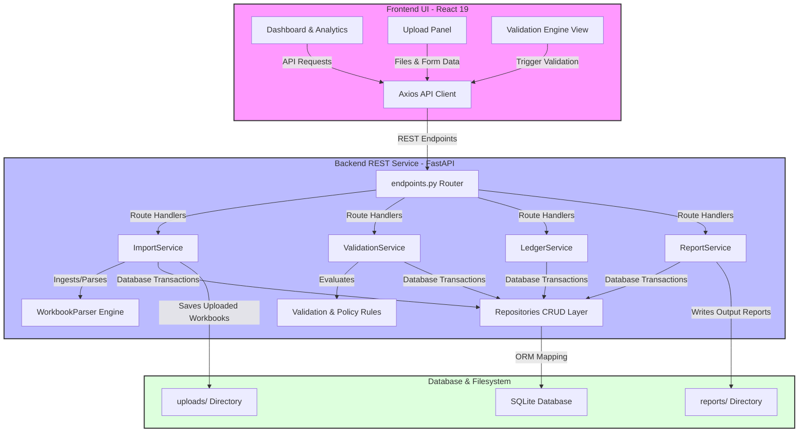

# TMPVL AuditIQ — Billing Audit & Fraud Detection System

[](https://www.python.org/)
[](https://nodejs.org/)
[](https://fastapi.tiangolo.com/)
[](https://react.dev/)
[](https://mui.com/)
[](#supported-platforms)

TMPVL AuditIQ is a production-grade, fully portable, offline-first enterprise application designed to audit, reconcile, and validate trainee billing submissions for **TMPVL**. The system automates the reconciliation process across three source workbooks (**BDC Master**, **Separations**, and **Vendor Invoices**), executing a comprehensive rule-based policy and fraud detection engine. It blocks duplicate claims, enforces strict tenure and annual payment caps, validates kit quantities, and maintains an immutable financial ledger.

---

## 🏗️ Architecture

The application is structured following Clean Architecture principles to separate API routing, business domain rules, database access, and data models. It is designed to run locally in air-gapped environments without external network dependency.

### System Architecture Diagram



---

## ✨ Features

- **Automated Rule Engine**: Executes a comprehensive 11-point validation suite checking trainee existence, joining dates, separation details, and double claims.
- **Fraud Detection Engine**: Flags duplicate Aadhaar/Ticket numbers, billing for blocked/separated employees, and repetitive submissions.
- **Incremental & Full Sync**: Sync modes allow standard profile additions or strict master file alignment (automatically deactivating missing trainees).
- **Centralized Config & Paths**: Built using `pathlib.Path` to resolve database, reports, and upload locations dynamically across Windows, Linux, and macOS.
- **Immuntable Payment Ledger**: Keeps an audit history of approved disbursements and tracks remaining trainee caps under a lifetime ₹1800 limit.
- **Multi-Format Ingestion**: Supports parsing from Excel workbooks (`.xlsx`, `.xls`) and PDF invoices.

---

## 🛠️ Technology Stack

- **Backend**:
  - **FastAPI** — High-performance ASGI web framework.
  - **SQLAlchemy ORM** — Relational database mapping.
  - **SQLite** — Lightweight, embedded single-file database.
  - **Pandas & OpenPyXL** — Excel spreadsheet ingestion and generation.
  - **pdfplumber** — Text extraction and parsing of PDF invoices.
- **Frontend**:
  - **React 19** + **TypeScript** — Single Page Application structure.
  - **Vite 8** — Next-generation frontend tooling and bundler.
  - **Material UI v6 (MUI)** — Component styling and layouts.
  - **AG Grid** — High performance data grid tables.
  - **Recharts** — Dynamic chart visualizations.

---

## 📁 Folder Structure

```text
TMPVL-AuditIQ/
├── backend/
│   ├── app/
│   │   ├── api/
│   │   │   ├── endpoints.py          # REST API Route handlers
│   │   │   └── schemas.py            # Pydantic request/response schemas
│   │   ├── core/
│   │   │   ├── config.py             # Centralized configurations and logging
│   │   │   └── db.py                 # SQLAlchemy engine & session configuration
│   │   ├── models/
│   │   │   └── models.py             # SQLAlchemy models & schema definitions
│   │   ├── repositories/
│   │   │   └── repositories.py       # DB CRUD repository patterns
│   │   └── services/
│   │       ├── import_service.py     # Data workbook parser orchestrator
│   │       ├── ledger_service.py     # Approved payout posting logic
│   │       ├── report_service.py     # Custom Excel/CSV exporter
│   │       ├── rules.py              # Individual policy validation rules
│   │       ├── validation_service.py # Validation pipeline orchestrator
│   │       └── workbook_parser.py    # Universal weighted excel classifier
│   ├── main.py                       # Backend startup entrypoint
│   ├── requirements.txt              # Backend dependencies
│   └── tests/                        # Pytest suite
├── frontend/
│   ├── src/                          # Frontend React source code
│   ├── package.json                  # Node dependencies
│   └── vite.config.ts                # Vite config
├── .env.example                      # Environment variables template
├── .gitignore                        # Git exclusion rules
├── LICENSE                           # Project license
└── run_all.py                        # Cross-platform service orchestrator
```

---

## ⚙️ Environment Variables

Copy the `.env.example` file in the project root to `.env` to customize settings:

```bash
cp .env.example .env
```

| Variable | Default Value | Description |
| :--- | :--- | :--- |
| `DATABASE_URL` | `sqlite:///backend/tmpvl_audit.db` | Path or connection URL to the SQLite database. |
| `HOST` | `127.0.0.1` | IP address for backend server binding. |
| `PORT` | `8000` | Port number for backend service. |
| `FRONTEND_URL` | `http://localhost:5173` | Allowed frontend origin for CORS. |
| `LOG_LEVEL` | `INFO` | Application log level (DEBUG, INFO, WARNING, ERROR). |
| `MAX_UPLOAD_SIZE` | `52428800` | Maximum file size in bytes (50MB). |
| `UPLOAD_DIRECTORY` | `uploads` | Directory where uploaded files are stored. |
| `REPORT_DIRECTORY` | `reports` | Directory where exported reports are written. |
| `TEMP_DIRECTORY` | `temp` | Directory for temporary file operations. |
| `PARSER_VERSION` | `2.0.0` | Ingestion parser classification version. |

---

## 🚀 Installation & Setup

### Prerequisites
- **Python**: Version 3.12 or newer.
- **Node.js**: Version 20 or newer (npm included).
- **Git**: Installed for cloning.

### 1. Clone the Repository
```bash
git clone https://github.com/maitray-agrawal/TMPVL-AuditIQ.git
cd TMPVL-AuditIQ
```

### 2. Configure Virtual Environment

#### Windows
```cmd
python -m venv .venv
call .venv\Scripts\activate
pip install -r backend/requirements.txt
```

#### Linux / macOS
```bash
python3 -m venv .venv
source .venv/bin/activate
pip install -r backend/requirements.txt
```

### 3. Install Frontend Dependencies
```bash
cd frontend
npm install
cd ..
```

---

## 💻 Running the Application

### Single-Command Orchestrator (Cross-Platform)
Run the Python orchestrator script in the repository root. It automatically runs the backend server, starts the React dev client, and opens your web browser:
```bash
python run_all.py
```

### Manual Execution

#### Backend Service
```bash
# Activate venv first, then:
set PYTHONPATH=.      # Windows CMD
$env:PYTHONPATH="."   # PowerShell
export PYTHONPATH=.   # Linux/macOS

python -m backend.main
```

#### Frontend Client
```bash
cd frontend
npm run dev
```

---

## 🧪 Running Tests

Verify backend logic and business rules by executing pytest in the root or backend directory:
```bash
# Ensure virtual environment is active
.venv/bin/python3 -m pytest   # Linux/macOS
.venv\Scripts\python -m pytest  # Windows
```

---

## 📖 Sample Workflow

```text
BDC Upload (Ingests active trainee profiles)
      ↓
Separation Upload (Ingests exit/DOL records)
      ↓
Invoice Upload (Ingests Quess vendor billing claims)
      ↓
Validation Engine (Performs 11-point policy checks)
      ↓
Fraud Detection (Flags duplicate IDs, blocked billings)
      ↓
Reconciliation (Caps joining/180-day payouts, saves ledger)
      ↓
Reports Export (Generates approved payouts and exception sheets)
```

1. **BDC Upload**: Upload the master sheet containing active trainees to establish profiles.
2. **Separation Upload**: Upload separation files to record leaving dates (DOL) and exit statuses.
3. **Invoice Upload**: Upload Quess vendor claim Excel or PDF invoices.
4. **Validation & Fraud**: Run the validation engine to identify warnings, errors, or fraud flags.
5. **Reconciliation & Ledger**: Approve the invoice. Payout limits are automatically updated, and details are logged to the immutable ledger.
6. **Reports**: Download approved payout lists, exception sheets, or executive summaries.

---

## ❓ Troubleshooting & FAQ

**Q: Database locked errors occur during validation.**
- **A**: The system enforces a 30-second database busy timeout. Ensure no external SQLite clients have active write transactions on `tmpvl_audit.db`.

**Q: Invoices are not showing up under validation.**
- **A**: Make sure the uploaded sheets are classified properly. Check the backend logs for `DETAILED PARSER DEBUG LOG` output to confirm headers and scores.

**Q: Frontend build fails.**
- **A**: Clean your node modules (`rm -rf node_modules` / `rm -rf frontend/node_modules`) and run `npm install` again.

---

## 📋 Supported Specifications

- **Supported Operating Systems**: Windows (10/11), Ubuntu/Debian (20.04+), macOS (Monterey+)
- **Python Version**: `>=3.12`
- **Node.js Version**: `>=20`
- **Browser Compatibility**: Chrome (latest), Edge (latest), Firefox (latest), Safari (latest)

---

## 📄 License
This project is licensed under the MIT License - see the LICENSE file for details.
